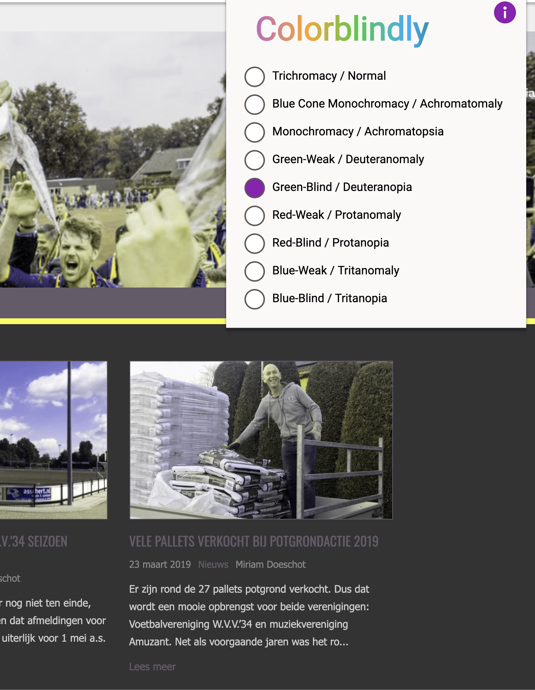

## Zonder javascript

[Lokale voetbalvereniging WVV](https://www.wvv34.nl/)

- Slider word niet getoont
- Menu blijft werken
- Standen worden niet geladen
- Content tabs werken niet meer
- Styling blijft hetzelfde
- Soms klopt de styling van bepaalde elementen niet meer
- Meeste content nog wel beschikbaar

[Basic fit](https://www.basic-fit.com/nl-nl)

- Je ziet de homepage wel
- Alle content is zichbaar tenzij je wil inschrijven dan zie je dat je je javascript aan moet doen
- Simpele dingen zoals google maps werken niet meer
- Op elke pagina staat boven de body `iframe(heigth="0" width="0" style="display:none;visibility:hidden" src="//www.googletagmanager.com/ns.html?id=GTM-PD6Q6J")`
- Je kan niet meer talen selecteren
- Zoeken werkt niet
- De website is misschien 30% nog bruikbaar? Content kan soms wel en niet gelezen worden

[Google](https://www.google.nl/search?q=test&gbv=1&prmd=ivns&ei=Oz6GXPGUM8HBlwSj9KbQCQ&start=50&sa=N)

- Google laat compleet oude versie van de website zien
- Afbeeldingen gaan gelijk naar de website zelf toe
- Video's werkt het zelfde als afbeeldingen, gaat niet via youtube

[Gmail](https://mail.google.com/mail/u/0/#inbox)

### Algemeen

- 0.2% of pageviews from worldwide traffic across all devices in the fourth quarter 2016 had javascript disabled
-

### Wat als je geen javascript hebt

- `noscript` tags als fallback
- Geen dynamische content client side laden, server side is dan de way-to-go
- Moderne framework die een SPA pagina maken kunnen server side rendering gebruiken (vue -> nuxt, react -> next).
-

#### Bronnen

[I Used The Web For A Day With JavaScript Turned Off](https://www.smashingmagazine.com/2018/05/using-the-web-with-javascript-turned-off/)
[Why and how to build a website without JavaScript](https://medium.com/@larsdouweschuitema/why-and-how-to-build-a-website-without-javascript-a220830afadb)
[What percentage of browsers with javascript disabled?](https://blockmetry.com/blog/javascript-disabled)

## Kleur

- 4.5% is kleurenblind van de populatie
- Mannen zjn vaker kleurenblind tot wel 8% (volgens de bron 1 op de 12 mannen)

#### Voorbeeld

Ik ga opnieuw de website van mijn lokale voetbalclub bekijken om te kijken of het kleurencontrast goed is.

[Link](https://www.wvv34.nl/)

- Met een groen blauw filter is de tekst als een stuk moeilijker te lezen, maar zeker niet onmogelijk.

- Zodra ik verder blader op de website vind ik niet veel problemen met de kleuren, ook niet door de verschillende filters te proberen.

**Tips om kleur contrasten te verbeteren**

- Zowel kleuren als symbolen gebruiken, niet de kleur lijdend alleen laten zijn.
- Probeer je kleuren pallete gelimiteerd te houden, zo is het makkelijker om goede contrasten te vinden.
- Probeer vervelende kleuren contrasten zoals blauw en paars, groen en bruin te vermijden.
- Patronen te gebruiken wanneer je contrast wil laten zien bij meerdere elementen (zoals grafieken) naast elkaar.
- Kijk altijd goed naar het contrast van een kleur op de achtergrond, te checken met [color review](https://color.review/)

Het is mogelijk om te kijken of je zelf een kleine afwijking met kleurenblindheid kan hebben door de [test](https://enchroma.com/pages/color-blindness-test#test) hier te doen.

De website kan getest worden door bijvoorbeeld `colorblindly` `Datlon` voor google chrome als extensie.

#### Bronnen

- https://axesslab.com/colorblind-accessibility-web-fail-success-cases/
- https://uxdesign.cc/color-blindness-in-user-interfaces-66c27331b858
- https://www.smashingmagazine.com/2016/06/improving-color-accessibility-for-color-blind-users/
- https://usabilla.com/blog/how-to-design-for-color-blindness/
